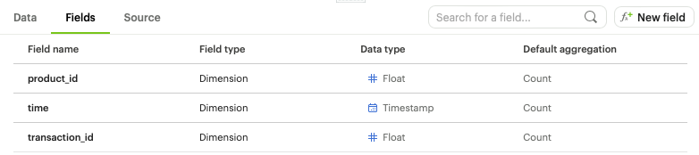

# Transaction Analysis

After you finished your analysis using the Inventory data set, you learned that there is another data set named `tutorial.excel_sql_transaction_data` which contains all transactions (sales) by product. 


Here is the schema (table structure) for the Transaction dataset:



And here is the schema to the first data set you played with, the Inventory dataset:


You can inspect the new data sets with 

```sql
-- Returns first 100 rows from tutorial.excel_sql_transaction_data
  SELECT * FROM tutorial.excel_sql_transaction_data LIMIT 100;
```


### Q1 - If you are to relate/join the two tables, then which columns would you use from each table?


### Q2 - Start by counting number of records from each table


`tutorial.excel_sql_transaction_data` total records =  ? 

```sql
-- Write your query

```


`tutorial.excel_sql_inventory_data` total records = ?

```sql
-- Write you query

```


Did you match the following numbers?


### Q3 - Append additional columns 

Join the two tables to append the additional columns as shown in the following output 

```sql
-- Write you query

```


### Q4 - Count number of transactions per product? Order the products by their transaction counts from highest to lowest.

```sql
-- Write your query
```


What does the number of transactions represents? 

What additional information or insight can you make with this metric?


### Q5 - [Challenge] Determine the number of remaining inventory per product

```sql
-- Write your query
```


### Q6 - [Challenge] What its he actual revenue per product? Sort by Actual Revenue from highest to lowest

```sql
-- Write your query

```


### Q7 - [Challenge] What is the actual revenue per Product Type? Sort by Actual Revenue from highest to lowest

```sql
-- Write your query

```


