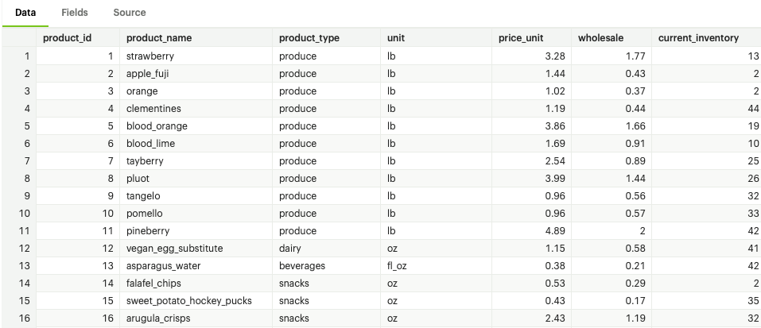
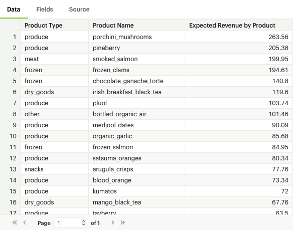
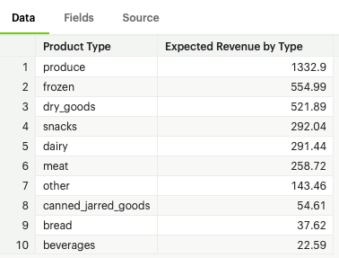
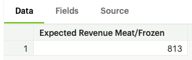
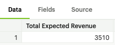

# Inventory Analysis


You are given the dataset `tutorial.excel_sql_inventory_data` to do some quick analysis using SQL.

As a starter to gain some basic high level intuition on the data you run the following query:

```sql
-- Returns first 100 rows from tutorial.excel_sql_inventory_data
  SELECT * FROM tutorial.excel_sql_inventory_data LIMIT 100;
```

This should produce the following output



You are given some investigative type questions and you will need to use your SQL skills to find the answers:


#### Q1 - What is the average unit price by Product Type? Show me from highest to lowest

```sql
-- Write your query

```

Your output should look like this. Make sure you output the same columns labels.


What are your observations?

### Q2 - What is the expected revenue per product? Show me from highest to lowest.

The expected revenue is calculated as: `Price_Unit X Current_Inventory`

```sql
-- Write your query

```


Your output should look similar to the following. Make sure to match the column names as they are more business friendly.



What are your observations?


### Q3 - What is the expected revenue by Product Type? Show me from highest to lowest?

```sql
-- Write your query

```


Your output should look similar to the following. Make sure to match the column names as they are more business friendly.




### Q4 - What is the expected revenue if we only sell our entire inventor in the Meat and Frozen departments (product types)? Round to the nearest whole number.


```sql
-- Write your query

```




What are your observations?


### Q5 - What is the total expected revenue from all products? Round to the nearest whole number.

```sql
-- Write your query

```




