# Sales Analysis Activity

After you completed your analysis for 2017 you realized there are additional data sources that are needed for a more comprehensive analysis. This includes sales data for 2018 and 2018, as well as store and product related data.

## Load the data & transform the data

* Load `sales_2018`, and `sales_2019` data sets

  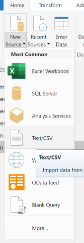

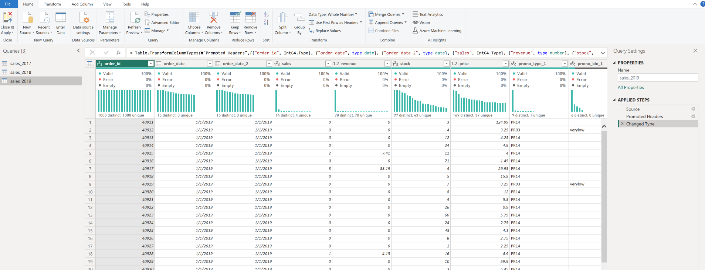

* In order to combine the sales data (2017, 2018, and 2019) make sure you have the same columns (names, and types) for all three data sets

Here are the columns and their data types. Make sure all three have the same 

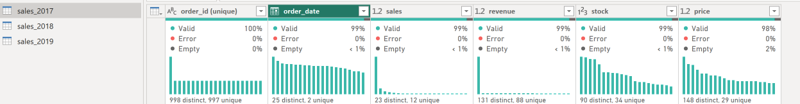

* Select Append Queries to stack the data on top of each other (2017, 2018, and 2019)

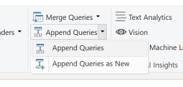

Then select `Three or more tables`

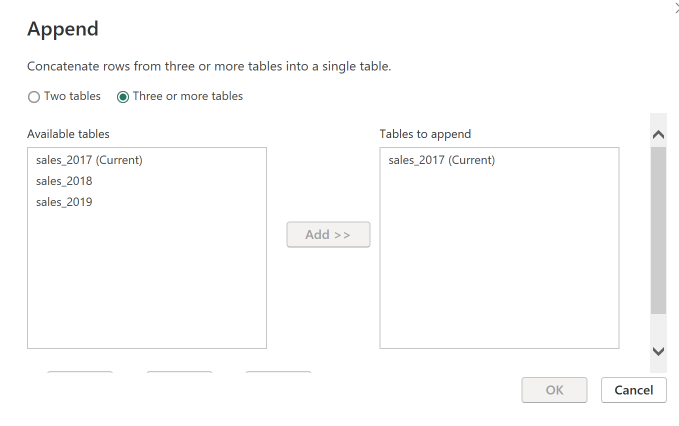

Combined 2018 and 2019 data with 2017 

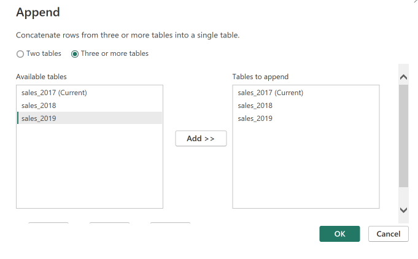

* Keep in mind the data is all combined under the `sales_2017` data. Rename the data from `sales_2017` to `combined`

## Load additional data to support your analysis 

* Now add three more files `sales_details`, `dim_products`, and `dim_stores`

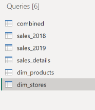

* Inspect the `sales_details` dataset 

  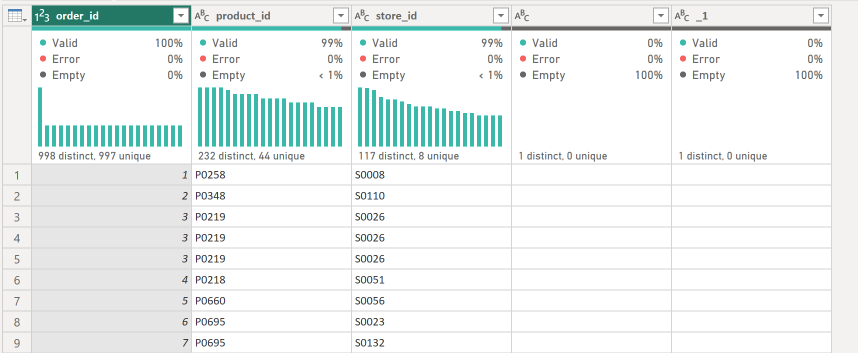

* Remove the last two columns 
* Inspect the `dim_products` dataset and notice we have several issues:

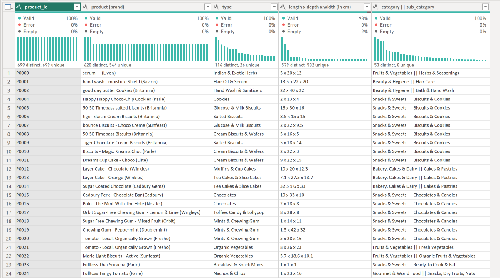

* Make the first row as headers 
* Click the `category || sub_category` column and split into two fields

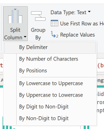

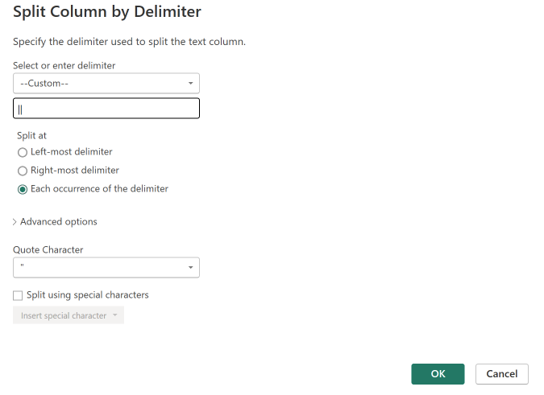

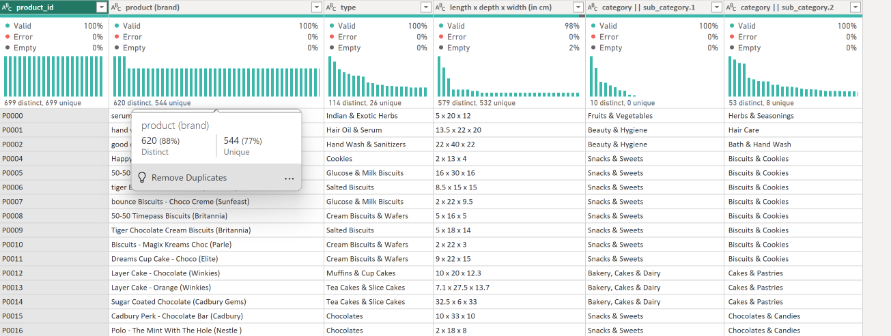

* Rename the column as shown

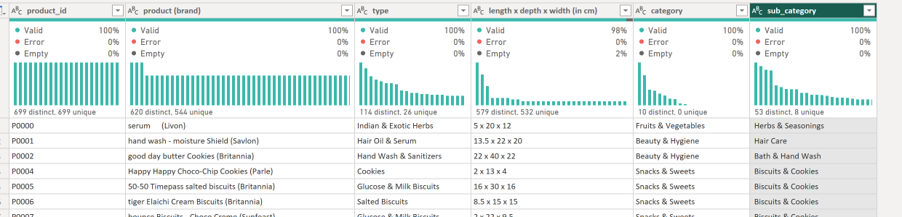

* Final inspect the `dim_stores` data set
* Make the first row as column header

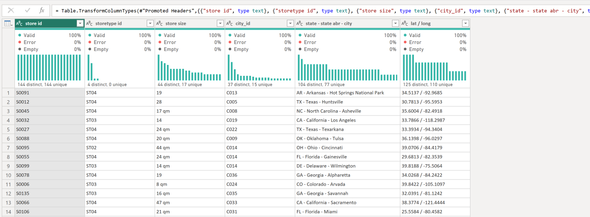

* Now for the remaining steps I will show you only the results and you will need to figure out how I split the columns.
* Strarting with the `state - state abr - city` column this is what I have after the transformation (spitting)

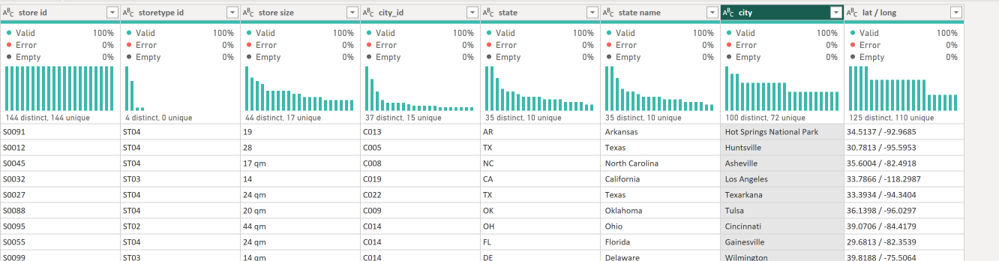

* For the `lat/long` here is what I have after the splitting

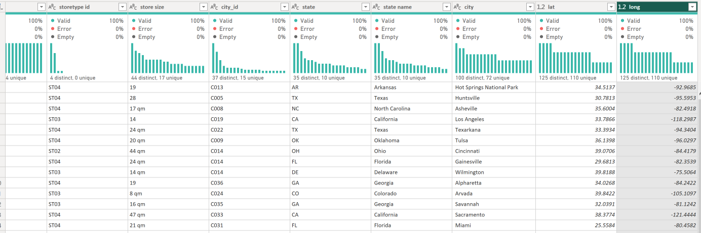

* Now, click Apply and Close

---

## Modeling the Data 

Click on the model icon 

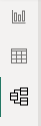

* First thing hide the sales_2018 and sales_2019 data sets since we already combined them in the combined data set 

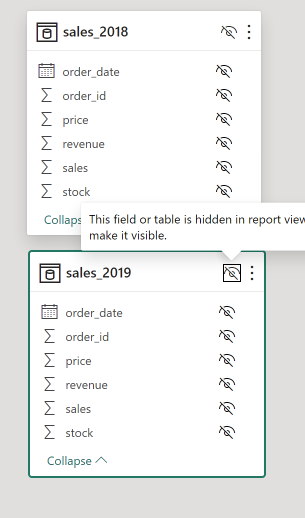

* Finish the modeling to obtain the following data model

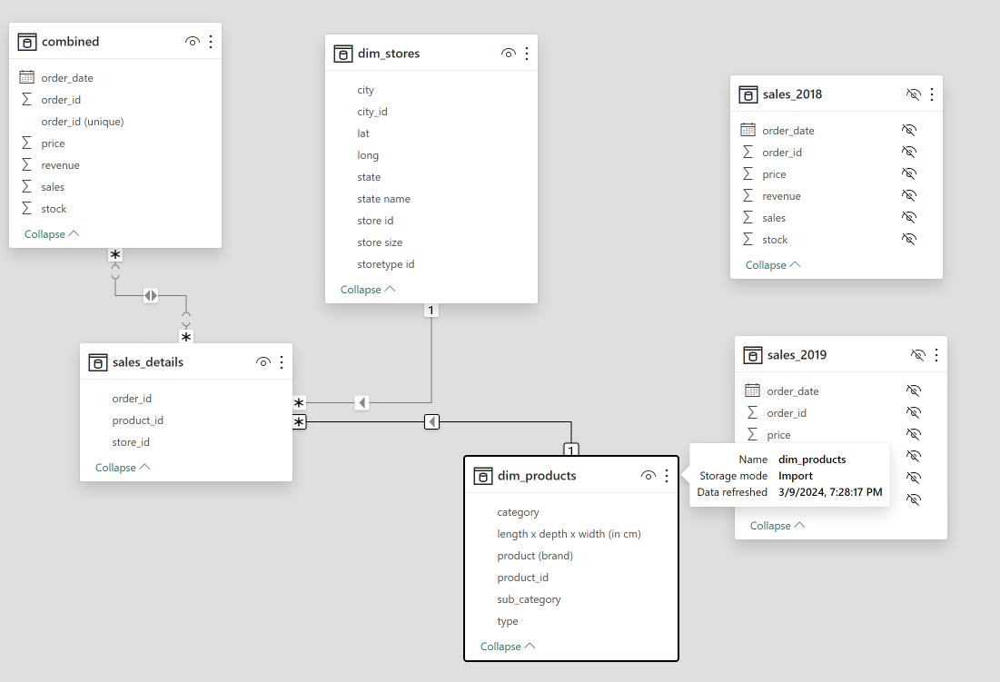

----

## Dashboard 

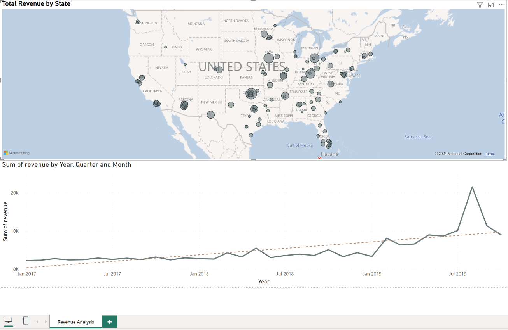

