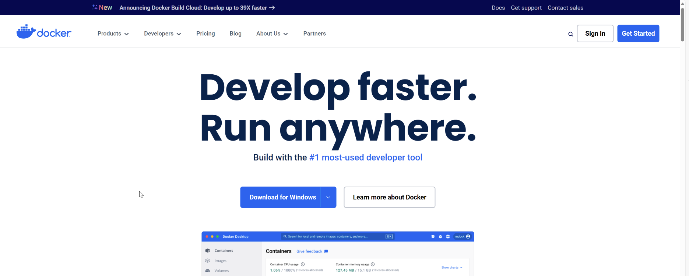

# Learning SQL

## SQL IDE/GUI 

**Installing a GUI (Graphical User Interface) or IDE (Integrated Development Environment)**

When you install a SQL database such as MySQL, PostgreSQL, SQLite, or others the most common way to interact with these database is through the terminal (or command line). Alternatively, for a more user friendly experience it is common to see SQL developers utilize an IDE (GUI based).  Here is a list of popular IDEs that you **can install and use for free**:

* **DBeaver** (recommended)
  * **Download**: To download the free community edition you can visit this link https://dbeaver.io/download/
  * Easy to use and supports many different databases whether cloud based or on-premise 
  * Easy to learn
  * Supports different OS including MacOS, Windows, and Linux 

* **pgAdmin**
  * **Download**: https://www.pgadmin.org
  * Supports different OS including MacOS, Windows, as well as a Docker container for cross-platform 
  * Primarily designed to an interface for **PostgreSQL** unlike DBeaver which supports multiple databases 
* **MySQL Workbench**
  * **Download**: https://www.mysql.com/products/workbench/
  * Supports different OS including MacOS, Windows, and Linux 
  * Supports multiple databases unlike pgAdmin. DBeaver offers a more modern and intuitive design overall 

---

# Installing a SQL Database

## Option A: Install a local database like PostgreSQL 

* To install PostgreSQL locally on your machine you can just go to PostgreSQL download page [here](https://www.postgresql.org/download/) and select the appropriate OS: Linux, MacOS, Windows ..etc
* For Window OS you can opt to use the Interactive Installer 

* This should take you to the download page from EDB. Select the latest version

* The Download should start 

* Once the file is downloaded just double click and follow the installation instructions 

Notice the installation come bundled with **pgAdmin** for the interface (IDE) which if you decided to use you can keep it checked otherwise if you want to use another tool like **DBeaver** you can uncheck it. Then click Next

Click Next.

Enter a password for the superuser (admin) named `postgres`. Make sure you document and remember the password

Keep the default port `5432`

Click next

Here keep the detail option for `locale` and click next 

In the installation summary just double check the options then click next to being the installation 

---

### Launching pgAdmin with PostgreSQL installation

* Once installation is complete you can launch pdAdmin

* 

## Option B: Install using Docker

* First, install Docker from ([Docker: Accelerated Container Application Development](https://www.docker.com/))
* Click the Download for Windows (or your other OS)

* Follow the instructions to install Docker
* Once Docker is installed you will have access to Docker Desktop also called Docker Dashboard 

* In the search bar on top type `postgresql`

* Select the first option which shows the official PostgreSQL docker image and click `pull`
* This will download the Docker image locally on your machine 

* Once completed, you can click on the `Images` option from the left panel

* There you will see all the images you have downloaded (pulled)
* Click on the run button

* This should pop a new window, then click on the **optional settings**

* In the optional settings you can fill out the additional information needed 

* Finally click run
* Your PostgreSQL database is now running as a container

* You can now connect your favorite IDE to the PostgreSQL. In the following example I am connecting my DBeaver as shown

You are now connected and ready to use your database

---

## Option C: Using Snowflake 

**What is Snowflake**

Snowflake is a cloud-based data warehousing platform that provides a single platform for data warehousing, data lakes, and data engineering. It is a fully managed service that can store and analyze all data records in one place, automatically scaling up or down its compute resources to load, integrate, and analyze data

**How to install**

Using Snowflake is the simplest setup since it is a cloud based solution (SaaS) and no installation is required. Just head to the Snowflake page https://www.snowflake.com/ and click START FOR FREE option

Enter your information and you will get a full access with 30-day trial and no credit card or payment is required. 

Snowflake already comes with its own GUI/IDE so no additional software is needed.

----

## Option D: Using SQLite

Another easy option to get started working with a SQL database is with SQLite. 

> SQLite is a software library that provides a relational database management system. It is an in-process library that implements a self-contained, serverless, zero-configuration, transactional SQL database engine. Unlike most other SQL databases, SQLite does not have a separate server process and reads and writes directly to ordinary **disk files**. It is widely used in various applications and is popular for its lightweight setup, minimal resource requirements, and cross-platform compatibility.

The easiest way to get started is via **DBeaver**

* Launch DBeaver and click on new connections

Select SQLite 

* Click Next

* Click on Create

* Give your database a name in the Save As option and chose where you want to the SQLite file (DB) saved

* Click Save

* Click Finish

And that’s it you know have a DB ready to use

----

